# **Panduan Penggunaan**

## Login Dan Hak Akses

- Untuk memulai aplikasi anda bisa membuka browser dan memasukan alamat berikut[`http://domsan.web.id/domsan`]
(http://domsan.web.id/domsan).
- Muncul tampilan halaman landing.
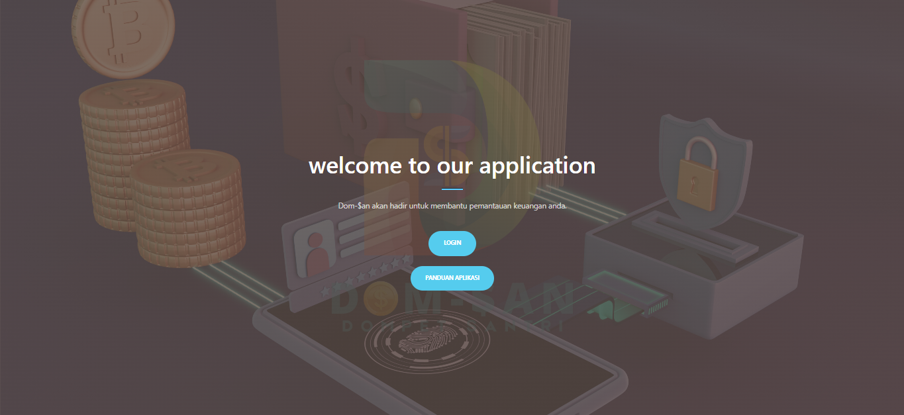
- Jika klik login akan masuk ke halaman **Login**.
- Jika klik panduan akan masuk ke halaman **Panduan**.
- Selamat anda telah masuk ke halaman Login.
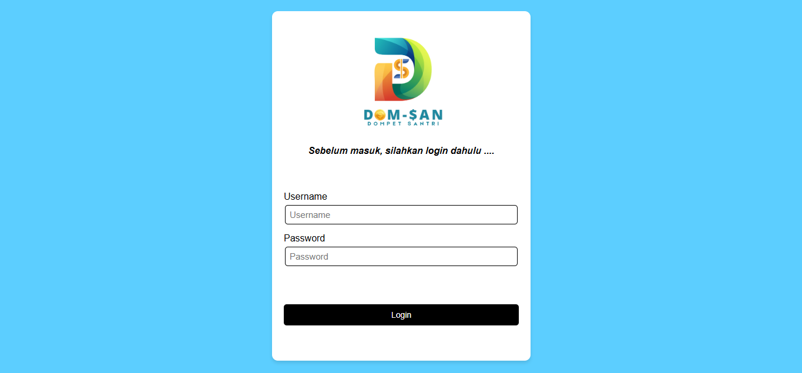
- Selamat anda telah masuk ke halaman Panduan.

## Tampilan Admin

Dashboard Dompet Santri bisa menampilkan berbagai informasi keuangan dan fitur yang berguna bagi admin dalam mengelola keuangan mereka. Berikut adalah beberapa elemen utama yang bisa dimasukkan dalam dashboard:

- Tampilan Admin

- Jika Klik Jumlah Nasabah

- Masuk Ke Data Nasabah

- Jika Ingin ke Tampilan Klik Tampilan

- Jika Klik Transaksi Hariini

- Akan Menampilkan

- Jika Ingin ke Tampilan Klik Tampilan

- Jika Klik Admin

- Akan Menampilkan
  

## Manajemen Data Santri

Berikut adalah struktur isi Manajemen Data Nasabah, yang bisa digunakan dalam sistem administrasi pesantren untuk mengelola data Nasabah secara efektif:

- Klik Data Nasabah 

- Maka Akan Muncul

- Jika Ingin Menambah Data Nasabah

- Akan Menampilkan

- Klik Kredit

- Akan Menampilkan
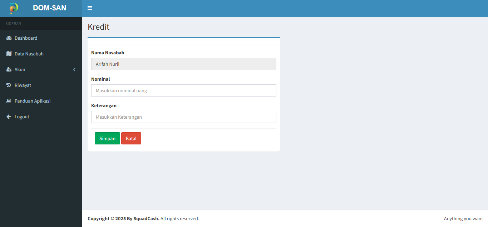
- Isi Sesuai Nama,Nominal,Keterangan
- Klik Simpan 

- Maka Akan Muncul Ke Data Nasabah

- Jika Klik Batal

- Maka Akan Muncul Ke Data Nasabah

- Klik Debit
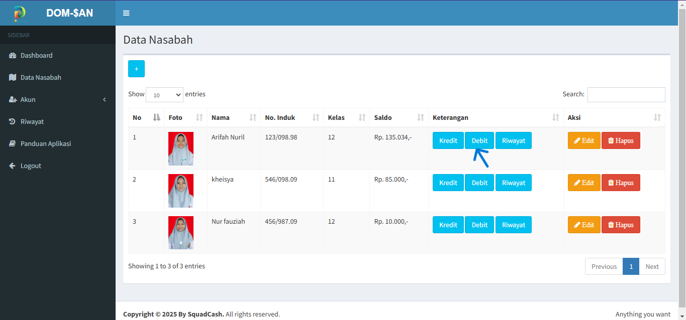
- Maka Akan Menampilkan
- 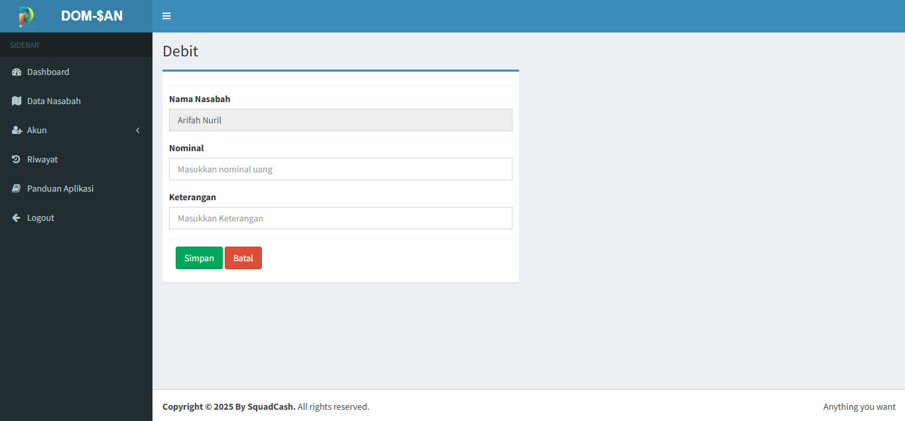
- Isi Sesuai Nama,Nominal,Keterangan
- Klik Simpan 

- Maka Akan Muncul Ke Data Nasabah

- Jika Klik Batal

- Maka Akan Muncul Ke Data Nasabah

- Klik Riwayat
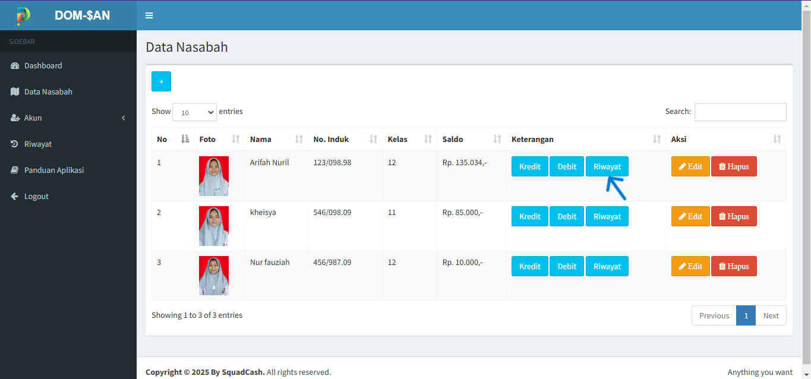
- Maka Akan Menampilkan

- Jika Ingin Mencetak Riwayat Transaksi Klik Cetak
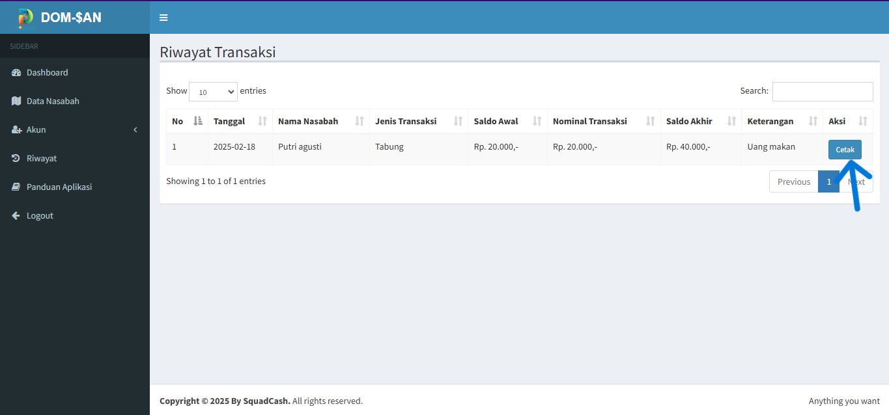
- Maka Akan Menampilkan

- Jika Klik Cancel
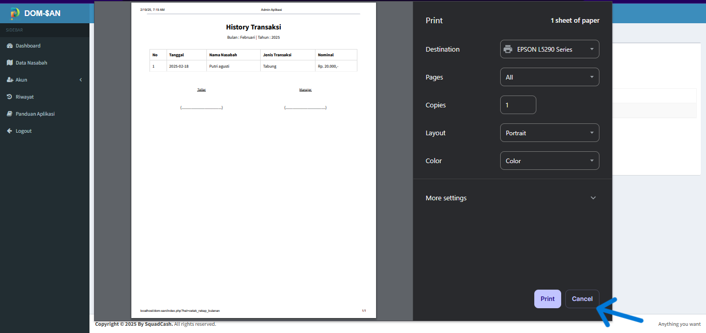
- Maka Akan Kembali Ke Riwayat

- Jika Inggin Mengedit Klik Edit

- Maka Akan Menampilkan

- Masukan Foto,Nama Lengkap,No Induk, Kelas,Saldo.
- Lalu Klik Simpan

- Maka Akan Muncul Ke Data Nasabah

- Jika Klik Batal

- Maka Akan Muncul Ke Data Nasabah

- Jika Klik Hapus

- Maka Akan Menampilkan

- klik Ok
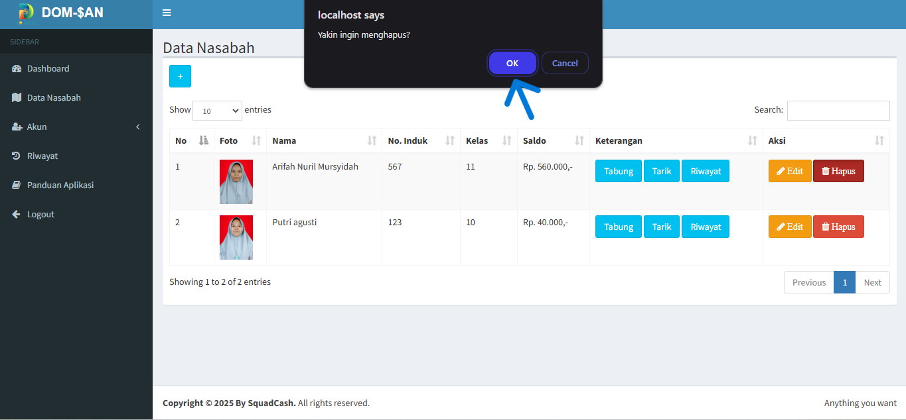
- Maka Akan Menampilkan
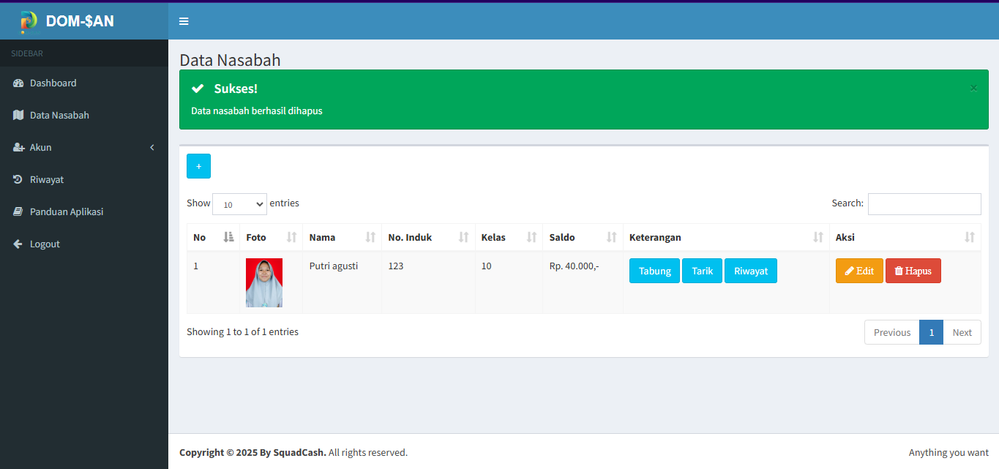

## Akun Admin Dan Nasabah

- Klik Akun Maka Akan Ada Dua Pilihan Admin Dan Nasabah

- Jika Klik Admin Maka Akan Menampilkan

- Kalau Ingin Menambahkan Admin Lalu Klik dan Masuk
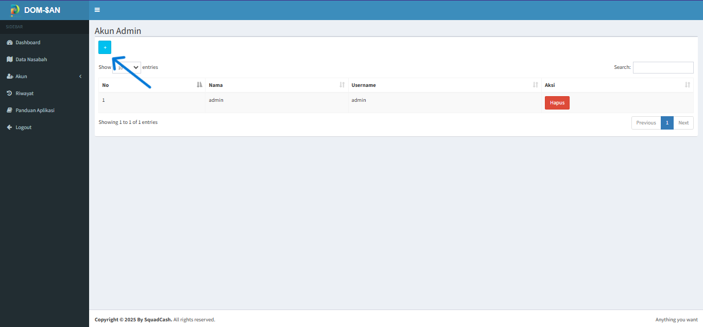
- Maka Akan Menampilkan

- Jika Klik Simpan  

- Maka Akan Kembali Ke 

- Jika Klik Batal 

- Maka Akan Kembali Ke 

- Jika Klik Nasabah Maka Akan Menampilkan

## Riwayat 

 - Klik Riwayat

- Maka Akan Menampilkan
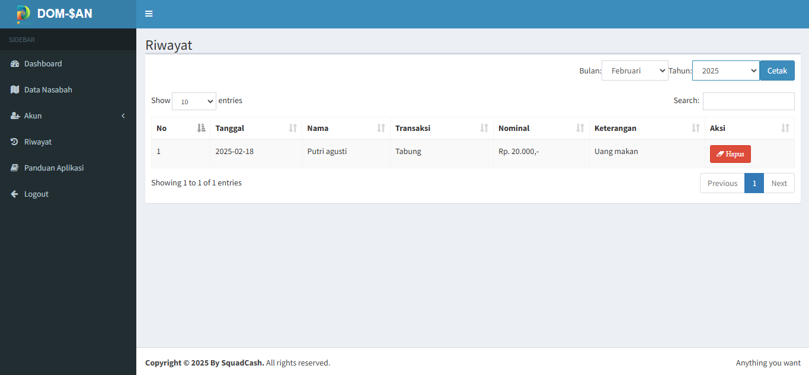
- Jika Ingin Mencetak Klik Cetak

- Maka Akan Muncul4
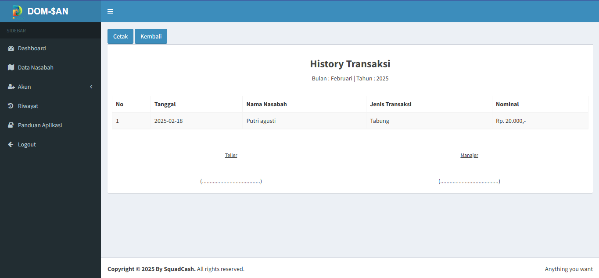
- Lalu Akan Memunculkan
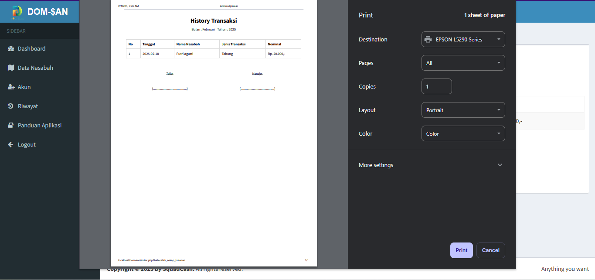
- Jika Ingin Print Klik Print
- Jika Ingin Cancel Klik Cancel

- Maka Akan Kembali Ke

- Jika Klik Panduan Aplikasi
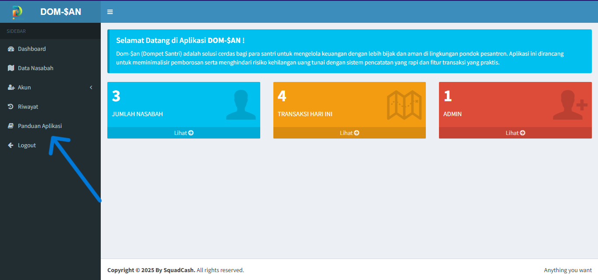
- Maka Akan Menampilkan

- Jika Klik Logout

- Maka Akan Menampilkan
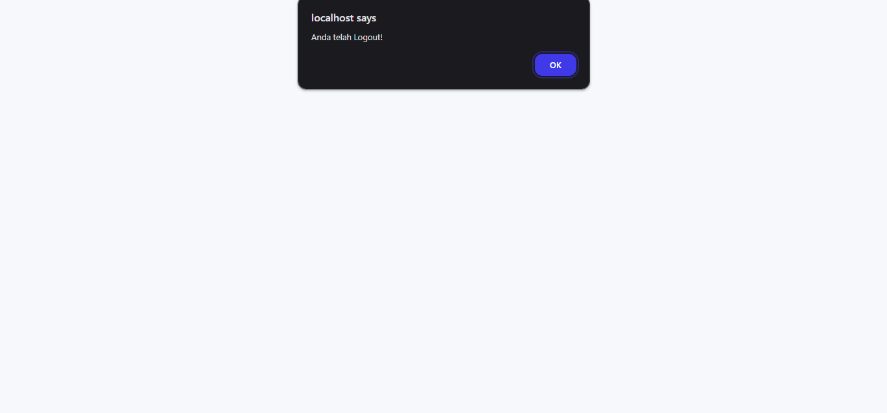

## Tampilan User
- Muncul tampilan halaman landing.

- Jika klik login akan masuk ke halaman **Login**.
- Jika klik panduan akan masuk ke halaman **Panduan**.
- Selamat anda telah masuk ke halaman Login.

- Masukan Username And Password Klik Login
- Lalu Akan Menampilkan Tampilan User

- Jika Klik Riwayat

- Maka Akan Menampilkan

